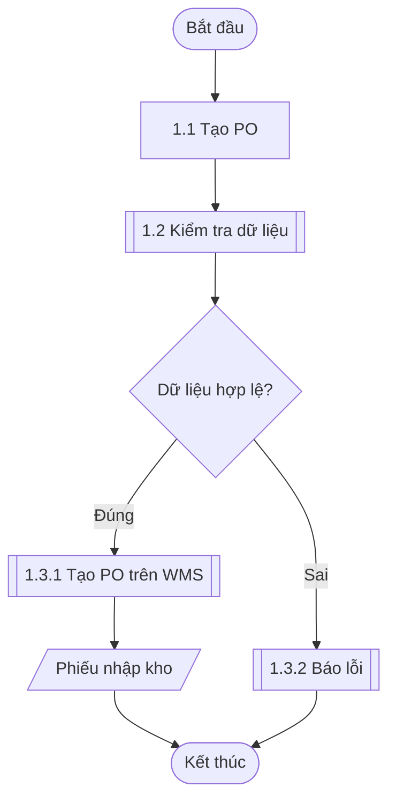

# HƯỚNG DẪN LƯU ĐỒ — Swimlane Smartlog (giao khách) + Mermaid (nguồn logic)

> **Ưu tiên cho bản giao khách: SƠ ĐỒ SWIMLANE phong cách Smartlog** (lane theo vai trò) — xem **`swimlane-guide.md`** (canonical). Mermaid chỉ là **nguồn logic/đối chiếu nhanh** và **fallback** khi chưa dựng swimlane.

**Quy trình khuyến nghị:**
1. Viết code **mermaid** trong `_TOBE-BLUEPRINT.md` (fence ```mermaid, thêm comment đầu `# src: <ten>`) để chốt logic nhanh; lưu vào `luu-do/<ten>.mmd`.
2. Dựng **swimlane**: tạo `luu-do/<ten>.json` → `python scripts/swimlane_generator.py "luu-do/<ten>.json"` → ra `<ten>.html` + `<ten>.png` (xem `swimlane-guide.md`).
3. Convert: `md_to_docx.py` tự **chèn PNG swimlane** thay block mermaid (khớp qua `# src:`). Có **cache**: PNG mới hơn HTML thì dùng lại.
4. *(tùy chọn)* `python scripts/mermaid_to_drawio.py "luu-do/<ten>.mmd"` → `.drawio` nếu cần bản vẽ tay theo stencil khác.

Phần dưới là cú pháp mermaid (nguồn logic / fallback):

## MAP KÝ HIỆU LƯU ĐỒ → MERMAID (dùng ĐÚNG subset này để converter drawio chạy ổn)
| Ý nghĩa | Cú pháp mermaid | Ghi chú |
|---|---|---|
| Bắt đầu / Kết thúc | `A([Bắt đầu])` | stadium |
| Bước thủ công (User) | `B[1.1 Tạo PO]` | rectangle |
| Bước hệ thống (System) | `C[[1.2 Kiểm tra dữ liệu]]` | subroutine (đậm) |
| Quyết định / phân nhánh | `D{Dữ liệu hợp lệ?}` | rhombus |
| Báo cáo / chứng từ / dữ liệu | `E[/Phiếu nhập kho/]` | parallelogram |
| Nối bước | `B --> C` | mũi tên |
| Nhánh có nhãn | `D -->|Đúng| F` / `D -->|Sai| G` | nhãn trên cạnh |

## QUY TẮC
- **Đánh số node KHỚP với bảng bước** (1.1, 1.2, 1.3.1 nhánh đúng, 1.3.2 nhánh sai).
- Dùng `flowchart TD` (trên→dưới) hoặc `LR` (trái→phải) tùy độ dài.
- ID node ngắn (A, B, C, S1, S2...); chữ tiếng Việt đặt trong nhãn.
- Mỗi node một dòng; mỗi cạnh một dòng — để converter drawio parse được.
- Tránh cú pháp nâng cao (subgraph lồng nhiều tầng, click, style inline phức tạp) ở bản dành cho drawio; nếu cần, giữ riêng bản mermaid "đẹp" và bản "đơn giản để convert".

## VÍ DỤ


## LEGEND trong tài liệu
Luôn có bảng Legend ký hiệu ở phần A.TỔNG QUAN (xem `table-patterns.md`) để người đọc hiểu các hình. Màu/stencil theo brand khách (mặc định header #176bb4) áp ở bước tinh chỉnh drawio.
